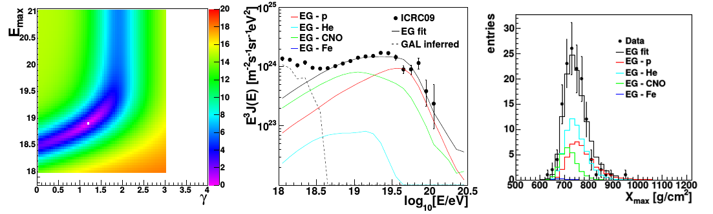

<p align="left">
  
</p>

# CRSourceFitter
A C++ software tool for fitting an astrophysical cosmic ray source model to combined spectrum and composition data. It was developed within the Pierre Auger Observatory project and used in the Auger composition-spectrum interpretation paper.
It is distributed for research use only under the GNU General Public License v3.0.

## **Credits**
If you use CRSourceFitter for your research, please acknowledge it in your papers by citing the following references:

* `S. Riggi et al., "Combined spectrum-Xmax fit with a likelihood approach", Pierre Auger Internal GAP Note 2011-101 (2011)
* `S. Riggi, "Measurement of the cosmic rays mass composition using hybrid data of the Pierre Auger Observatory", PhD thesis, University of Catania (Italy) (2010)`

or consider including me (`S. Riggi, INAF - Osservatorio Astrofisico di Catania, Via S. Sofia 78, I-95123, Catania, Italy`)
as a co-author on your publications.

## **Status**
This software is currently not actively maintained.

## **Installation**  

### **Prerequisites**
Install the project mandatory dependencies:  
* ROOT [https://root.cern.ch/]

Make sure you have set the following environment variables to the external library installation dirs 
* ROOTSYS: set to ROOT installation prefix

NB: Modify Makefile CPPFLAGS and LDFLAGS in case the dependency tools cannot be found.

### **Build**
To build the project:

* Clone this repository into your local $SOURCE_DIR    
  ```git clone https://github.com/PierreAugerObservatory/CRSourceFitter.git $SOURCE_DIR```    
* In the project directory type:    
  ```make```  

Binaries will be placed in the bin/ directory and libraries in the lib/ directory.

### **Usage**
* ```CRSourceFitter [--config=[path-to-configfile]] [--draw] [--input=[path-to-inputfile]]```    
&nbsp;&nbsp;&nbsp;&nbsp;&nbsp;&nbsp;&nbsp;```--config=[path-to-configfile] - Configuration file name with source fit run options```    
&nbsp;&nbsp;&nbsp;&nbsp;&nbsp;&nbsp;&nbsp;```--input=[path-to-inputfile] -  Input file name (.root) containing fit info to be drawn```   
&nbsp;&nbsp;&nbsp;&nbsp;&nbsp;&nbsp;&nbsp;```--draw - Draw fitted results instead of running source fit```    
